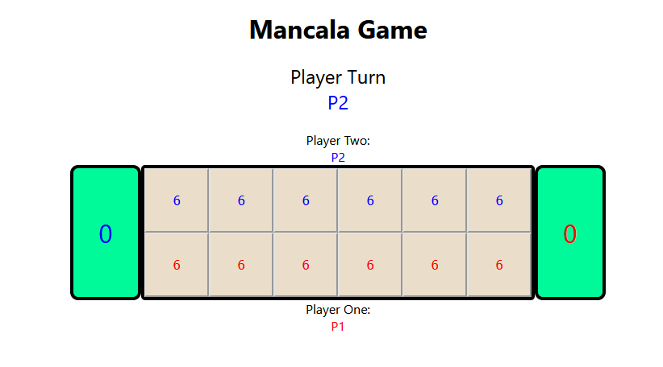
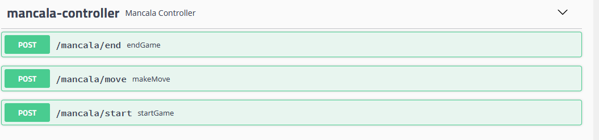

# Carlos Sedano

# Mancala Game

<!-- TABLE OF CONTENTS -->
<details open="open">
  <summary>Mancala Game</summary>
  <ol>
    <li>
      <a href="#synopsis">Synopsis</a>
      <ul>
        <li><a href="#built-with">Built With</a></li>
      </ul>
    </li>    
    <li>
      <a href="#gameplay">Gameplay</a>
    </li>
    <li>
      <a href="#getting-started">Getting Started</a>
      <ul>
        <li><a href="#prerequisites">Prerequisites</a></li>
      </ul>
    </li>
    <li><a href="#generate-a-jar">Generate a JAR</a></li>
    <li><a href="#backend">Backend</a>
      <ul>
        <li><a href="#test">Test</a></li>
      </ul>
    </li>
    <li><a href="#frontend">Frontend</a></li>
    <li><a href="#usage">Usage</a></li>
    <li><a href="#test">Tests</a></li>
    <li>
      <a href="#technical-information">Technical Information</a>
      <ul>
        <li><a href="#code-architecture-backend">Code architecture Backend</a></li>
      </ul>      
        <ul>
        <li><a href="#code-architecture-frontend">Code architecture Frontend</a></li>
      </ul>
    </li>
    <li><a href="#swagger-ui">Swagger UI</a></li>
    <li><a href="#contact">Contact</a></li>
  </ol>
</details>

## Synopsis

The mancala games are a family of two-player turn-based strategy board games played with small stones, beans, or seeds
and rows of holes or pits in the earth, a board or other playing surface. The objective is usually to capture all or
some set of the opponent's pieces.- [Wikipedia](https://en.wikipedia.org/wiki/Mancala)

### Built With

* [IntelliJ IDEA](https://www.jetbrains.com/idea/)
* [Spring Boot](https://spring.io/projects/spring-boot)
* [Lombok](https://projectlombok.org/)
* [Swagger](https://swagger.io/specification/v2/)
* [Gradle](https://gradle.org/)
* [ReactJS](https://reactjs.org/)

## Gameplay

> * The board is designed for two players. There are six pits on each player's side and a Mancala (large pit) on either
    > end.
>* To start place 6 stones in each pit, leaving the Mancalas empty.
>* Decide who goes first. (Randomly)
>* One player picks up all the stones in one of their own pits.
>* Starting with the next pit (counterclockwise), drop one stone in each pit including your own Mancala and skipping your
   > opponent’s Mancala.
>* If the last stone is dropped in your own Mancala, you get to play again.
>* If the last stone is dropped in an empty pit on your own side and there are stones in the pit opposite the pit adhere
   > you just dropped the last stone, then you get to capture your own stone and all the stones in the opposite pit and
   > place this all in your own Mancala. Otherwise, it is the other players turn.
>* Then all the pits on one side are empty, the other player gets to take all the stones on their own side and place
   > those stones into their own Mancala.
>* At the end, whoever has the most stones in their Mancala wins.


<!-- GETTING STARTED -->

## Getting Started

### Prerequisites

* Install [IntelliJ IDEA](https://www.jetbrains.com/idea/), configure & install plugins
    * Plugins - Press `Ctrl`+`Alt`+`S` / `Cmd`+`,` to open IDE settings and select **Plugins**. Find the plugin in
      the **Marketplace** and click **Install**. For more information
      see [IntelliJ oficial wiki](https://www.jetbrains.com/help/idea/managing-plugins.html#install_plugin_from_repo)
        * [google-java-format](https://plugins.jetbrains.com/plugin/8527-google-java-format)
    * Optional plugins
        * [Rainbow Brackets](https://plugins.jetbrains.com/plugin/10080-rainbow-brackets)
    * Enable annotation processing - Press `Ctrl`+`Alt`+`S` / `Cmd`+`,`  to open IDE settings and select **Build,
      Execution, Deployment** | **Compiler** | **Annotation Processors** and make
      sure ```Enable annotation processing``` is checked. For more information
      see [IntelliJ oficial wiki](https://www.jetbrains.com/help/idea/annotation-processors-support.html)

* Install [Postman](https://www.postman.com/) (Optional)
* Install [Gradle](https://gradle.org/install/)
     ```sh
    -----------------------------------------------------
    Gradle 7.2
    ------------------------------------------------------------
    
    Build time:   2021-08-17 09:59:03 UTC
    Revision:     a773786b58bb28710e3dc96c4d1a7063628952ad
    
    Kotlin:       1.5.21
    Groovy:       3.0.8
    Ant:          Apache Ant(TM) version 1.10.9 compiled on September 27 2020
    JVM:          11.0.8 (AdoptOpenJDK 11.0.8+10)
   ```
* Install [OpenJDK 11](https://openjdk.java.net/projects/jdk/11/)
*
Install [nvm](https://github.com/nvm-sh/nvm?fbclid=IwAR2AaWmjSE--7nfr9qgNqGt9Hit-Qt6VwNW2r8SYkUcz9GqfbExwb9qNy9s#installing-and-updating)
or [nvm-windows](https://github.com/coreybutler/nvm-windows)
* Node v16.13.0
* npm v8.1.0
* Install [yarn](https://classic.yarnpkg.com/lang/en/docs/install/#windows-stable)  1.22.17

> IMPORTANT : If you do not want to install nvm, NodeJS nor yarn, you can use Gradle to generate a JAR file with all the dependencies. Follow the instructions below.

## Generate a JAR

* If you do not want to install Node.js, nvm, neither Yarn nor you do have a different versions. You can follow these
  steps in order to generate a JAR and execute it.

> If you don't want to generate and run a JAR file and prefer to run it manually, go to the Backend section followed by the Frontend.

1. Clean with Gradle
   ```sh
   $ ./gradlew clean
   ```
2. Execute a task with Gradle in order to download all the dependencies under the project.
   ```sh
   $ ./gradlew executeYarn
   ```
3. Let's generate a JAR file.
   ```sh
   $ ./gradlew bootJar
   ```
4. We're ready to go, run the JAR file that has been created in order to start the app.
   ```sh
   $  java -jar build/libs/malanca-0.0.1-SNAPSHOT.jar
   ```
5. Open http://localhost:8080 to view it in the browser.

## Backend

**Run Backend**

1. Clean and build with Gradle
   ```sh
   $ ./gradlew clean build
   ```
2. Run the backend project app on local with Gradle
   ```sh
   $ ./gradlew bootRun
   ```
   > It will be running at http://localhost:8080

3. (Optional) Generate and run jar file only for backend purposes
   ```sh
   $ ./gradlew bootJar
   ```
   > The jar is created under the $project/build/libs/ folder
   ```sh
   $ java -jar malanca-0.0.1-SNAPSHOT.jar
   ```

## Test

1. Execute bundle of unit and integration tests
   ```sh
   $ ./gradlew test
   ```

## Frontend

**Run Frontend**

1. First, check our version of Node after installing it with nvm If the installation was successful, you should be able
   to run the following command.
   ```sh
    $ node --version
    v16.13.0

    $ npm --version
    8.1.0   
   ```
2. Yarn installation
    * After installing node, this project will need yarn too, so just run the following command.
   ```sh
    $ npm install -g yarn   
   ```

3. In the fronted project directory (called frontend folder), you need to install all the dependencies listed within
   package.json in the local node_modules folder.
   ```sh
    $ yarn install   
   ```


4. In the fronted project directory (called frontend folder), you can start the application:
   ```sh
    $ yarn start   
   ```

> Runs the app in the development mode.

4. Open http://localhost:3000 to view it in the browser.

> Known issues on Windows: [Error PS1 Can Not Be Loaded](https://www.c-sharpcorner.com/article/how-to-fix-ps1-can-not-be-loaded-because-running-scripts-is-disabled-on-this-sys/)

## Usage



## Technical Information

### Code architecture Backend

**src/main/java/com/game/mancala**

- **config/apidocumentation** - Contains Swagger configuration class for API documentation
- **controller** - Contains all controllers (Our API endpoints). This controllers uses @Service classes located at
  business package
    - **error** - Contains response exception handler and all exception classes for Mancala game api
- **domain/dto** - Contains all objects related to Mancala game project
    - **requests** - Contains request objects for the game API (DTOs)
    - **responses** - Contains response objects for game API (DTOs)
- **mapper** - Contains mappers to build from a DTO request to a DTO response
- **service** - Contains all business logic
- **util** - Contains common resources for this project

**java/resources**

- **application.properties** - Contains all properties for Mancala game app

**src/test/java/com/game/mancala**

- **integration** Contains all the integration tests for the project
- **unit** Contains all the unit tests for the project
- **utils** Contains a helper class for mocking a object

### Code architecture Frontend

**src/main/frontend**

- **public** - Public folder that can be referenced from the index.html where is the page template.
- **src** - Contains all the files related to run the app.
    - **components** - Contains all components necessary in order to render the app.
- **package.json** - Store the metadata associated with the project as well as to store the list of dependency packages.

## Swagger UI

Open Swagger UI

http://localhost:8080/swagger-ui.html



## Contact

[Carlos Sedano](https://www.linkedin.com/in/carlos-sedano)


